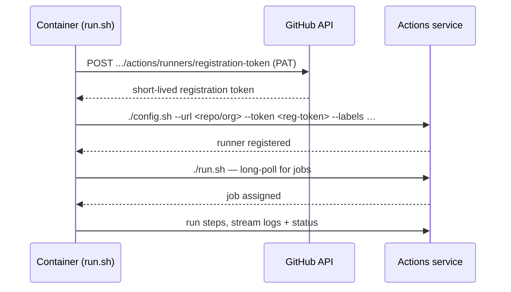

# Self-Hosted GitHub Actions Runners (Dockerized)

Dockerized GitHub Actions self-hosted runners built on **Ubuntu 24.04**. A single shared base image serves both **repository-scoped** and **organization-scoped** runners, so you can stand up either kind in about a minute and run your own CI on your own hardware.

Use these when you need things GitHub-hosted runners can't easily give you: custom or beefier hardware, access to a private network, warm build caches, or pre-installed tooling.

> [!WARNING]
> Self-hosted GitHub runners are meant to be used on private repositories. Using them on public repositories is not recommended and may lead to [security issues](https://docs.github.com/en/actions/how-tos/manage-runners/self-hosted-runners/add-runners). See GitHub's [Secure use reference](https://docs.github.com/en/actions/reference/security/secure-use) for more details.

**What's included in every runner:**

- Ubuntu 24.04
- Docker CLI + Buildx + Compose plugin (Docker-in-Docker via socket mount)
- GitHub CLI (`gh`)
- Node.js 22 LTS
- Python 3 + pip + venv
- Common build tools (`git`, `curl`, `wget`, `jq`, `build-essential`, …)

---

## Contents

- [Quick start](#quick-start)
- [Prerequisites](#prerequisites)
- [Project layout](#project-layout)
- [Repo runner](#repo-runner)
- [Org runner](#org-runner)
- [Targeting runners in workflows](#targeting-runners-in-workflows)
- [Scaling](#scaling)
- [Updating the runner version](#updating-the-runner-version)
- [Stopping and deregistering](#stopping-and-deregistering)
- [How it works](#how-it-works)
- [Security notes](#security-notes)
- [Troubleshooting](#troubleshooting)

---

## Quick start

Three steps: **clone → configure → run.** First make sure you have [Docker + Compose](#prerequisites) and a [Personal Access Token](#prerequisites).

```bash
git clone <this-repo-url> && cd <this-repo>
```

**Option A — a runner for one repository:**

```bash
cd repo-runner
cp .env.example .env
# edit .env: set REPO_OWNER, REPO_NAME, ACCESS_TOKEN
docker compose up --build -d
```

**Option B — a runner for a whole organization:**

```bash
cd org-runner
cp .env.example .env
# edit .env: set ORGANIZATION, ACCESS_TOKEN
docker compose up --build -d
```

**Verify it registered:**

```bash
docker compose logs -f          # watch for "Listening for Jobs"
```

Then confirm it shows up in GitHub:

- **Repo runner:** `Settings → Actions → Runners`
- **Org runner:** `Organization Settings → Actions → Runners`

Point a workflow at it (see [Targeting runners](#targeting-runners-in-workflows)) and you're done.

---

## Prerequisites

- **Docker** and **Docker Compose** on the host.
- A **GitHub Personal Access Token (PAT)**. The token is used only at startup to register the runner — see [How registration works](#how-a-runner-registers).

Required scopes depend on what the runner is attached to:

| Runner scope | Classic PAT scope | Fine-grained token permission |
| --- | --- | --- |
| **Repo** runner | `repo` | Repository → **Administration**: Read & write |
| **Org** runner | `admin:org` | Organization → **Self-hosted runners**: Read & write |

> [!TIP]
> Fine-grained tokens (they start with `github_pat_`) let you scope access to exactly the repos/org you need, which is safer than a classic `repo`/`admin:org` token. Permission names occasionally change. If registration fails with a 403, check the current requirements in the [GitHub docs](https://docs.github.com/en/actions/hosting-your-own-runners).

---

## Project layout

```
📁github-self-hosted-docker-runners/
├── Dockerfile              # multi-stage base — all tools, plus a named target per runner type
├── LICENSE
├── 📁org-runner/
│   ├── docker-compose.yml
│   └── run.sh              # registers and starts an org-scoped runner
├── README.md
└── 📁repo-runner/
    ├── docker-compose.yml
    └── run.sh              # registers and starts a repo-scoped runner
```

A single `Dockerfile` builds one fat `base` stage (all the tooling) and a thin stage per runner type on top of it. Each runner type's `docker-compose.yml` just selects the matching build target. See [How it works](#the-multi-stage-image) for why it's structured this way.

---

## Repo runner

Registers a runner scoped to a **single repository**. Any workflow in that repo can use it.

```bash
cd repo-runner
cp .env.example .env
```

Edit `.env`:

```env
RUNNER_VERSION=2.322.0
REPO_OWNER=your-username-or-org
REPO_NAME=your-repo-name
ACCESS_TOKEN=ghp_xxxxxxxxxxxxxxxxxxxx
```

Start it:

```bash
docker compose up --build -d
```

Target it from a workflow (substitute your actual owner/name — `runs-on` takes a literal label, not a variable):

```yaml
# for REPO_OWNER=acme and REPO_NAME=web-app
runs-on: github-actions-acme-web-app-runner
```

---

## Org runner

Registers a runner scoped to an **entire organization** — any repo in the org can use it.

```bash
cd org-runner
cp .env.example .env
```

Edit `.env`:

```env
RUNNER_VERSION=2.322.0
ORGANIZATION=your-org-name
ACCESS_TOKEN=ghp_xxxxxxxxxxxxxxxxxxxx
```

Start it:

```bash
docker compose up --build -d
```

Target it from a workflow:

```yaml
# for ORGANIZATION=acme
runs-on: github-actions-acme-runner
```

---

## Targeting runners in workflows

GitHub matches a job's `runs-on` against a runner's **labels** (not its name). When you list several labels, **all** of them must match.

Every runner here automatically gets the standard labels GitHub assigns — `self-hosted`, the OS (`Linux`), and the architecture (`X64`) — plus a **custom label** set in `run.sh` for precise routing.

```yaml
jobs:
  build:
    # lands on ANY of your self-hosted runners
    runs-on: self-hosted

  build-precise:
    # lands ONLY on runners carrying this exact custom label
    runs-on: github-actions-acme-web-app-runner

  build-linux-x64:
    # requires all three labels to match
    runs-on: [self-hosted, linux, X64]
```

Use the custom label when you have several fleets and want a job to run on a specific one. Use `self-hosted` when any of your runners will do.

---

## Scaling

Each container registers as exactly **one** runner. To run several in parallel, use `--scale`:

```bash
docker compose up --build -d --scale github-actions-repo-runner=3
```

This starts 3 containers, each registering as a separate runner. GitHub distributes queued jobs across them automatically.

> [!NOTE]
> When scaling, remove the `container_name` field from `docker-compose.yml` — Docker can't give the same name to multiple containers.

---

## Updating the runner version

The runner version is baked into the image at build time, so updating means changing the value **and rebuilding**. See [How it works](#how-it-works) for more details.

1. Find the latest release at [github.com/actions/runner/releases](https://github.com/actions/runner/releases).
2. Update `RUNNER_VERSION` in your `.env`.
3. Rebuild:

```bash
docker compose up --build -d
```

> [!NOTE]
> Keeping the version reasonably current matters. GitHub rejects runners that are too far behind. Runners also self-update by default, hence we pinned the version inside `run.sh` to avoid that happening mid-job.

---

## Stopping and deregistering

Runners deregister themselves cleanly on `SIGINT` / `SIGTERM`, so a normal stop is all you need:

```bash
docker compose down
```

If a container is killed instead of stopped gracefully (e.g. `docker kill`, host crash), its runner may linger as **offline** in GitHub. Remove stragglers manually under `Settings → Actions → Runners`. GitHub also auto-removes runners that have been offline for 14 days.

---

## How it works

This section is the "what's actually going on" tour. You don't need any of it to use the runners, but it helps when something breaks or you want to extend the setup.

### The big picture

A self-hosted runner is just a small program from GitHub (the [`actions/runner`](https://github.com/actions/runner) release) wrapped in a container. When the container starts it tells GitHub *"I exist and I'm ready,"* then sits in a long-poll loop waiting to be handed work. When a workflow says `runs-on: <a label this runner has>`, GitHub leases the job to an idle runner, which checks out your code, runs the steps, streams logs back, and reports the result. Nothing about your workflow YAML changes except the `runs-on` line.

```
   your repo/org          GitHub Actions            this host
  ┌─────────────┐        ┌──────────────┐        ┌───────────────────┐
  │  workflow   │  job   │   scheduler  │  lease │  runner container │
  │ runs-on: …  ├───────►│   + queue    ├───────►│  (run.sh polling) │
  └─────────────┘        └──────────────┘        └────────┬──────────┘
                                                          │ docker.sock
                                                          ▼
                                                   host Docker daemon
                                                   (builds/runs images)
```

### How a runner registers

You never hand your PAT to the runner process directly. The PAT is used **once**, at startup, to ask GitHub for a **short-lived registration token**, and that token is what actually configures the runner.

Concretely, each `run.sh` does roughly this:



The registration token expires within about an hour, so even if it leaked out of the container it's far less dangerous than the PAT itself. The PAT is the secret worth protecting, see [Security notes](#security-notes).

### The multi-stage image

The `Dockerfile` is split into a **fat base stage** and several **thin per-runner-type stages**.

The `base` stage installs everything heavy — Ubuntu packages, the Docker CLI, Node, Python, the build toolchain, and the runner tarball itself. Because all of that lives in one cached layer, it's built **once** and shared by every runner type. Each runner type is then just a few lines on top of `base` that copy in the right `run.sh` and set the entrypoint:

```dockerfile
FROM base AS repo-runner
COPY repo-runner/run.sh /run.sh
RUN chmod +x /run.sh
USER docker
ENTRYPOINT ["/run.sh"]
```

Two consequences worth knowing:

- **Adding a runner type is cheap** — see [Adding a new runner type](#adding-a-new-runner-type).
- **The runner version is fixed at build time** via the `RUNNER_VERSION` build arg. That's why changing it requires `--build`.

### Docker-in-Docker

Workflows frequently need to build or run containers themselves. Instead of running a full Docker daemon *inside* each runner, the compose files mount the host's Docker socket into the container:

```yaml
volumes:
  - /var/run/docker.sock:/var/run/docker.sock
```

The `docker` CLI inside the runner then talks to the **host's** Docker daemon directly. Any image it builds or container it starts is actually created on the host, as a sibling of the runner container. The base image adds the runner user to the `docker` group so it's allowed to use that socket. No `docker:dind` sidecar needed.

This is simpler and faster than a sidecar — but it has a real security cost, covered next.

### Persistent vs. ephemeral runners

By default these runners are **persistent**: a container registers once and serves many jobs over its lifetime, only deregistering when it shuts down. That's efficient and keeps caches warm — but it also means state from one job (files in the work directory, leftover Docker images, stray processes) can carry into the next unless your workflow cleans up after itself.

If you want hard isolation between jobs, register with the `--ephemeral` flag in `run.sh`. The runner then processes exactly **one** job and exits. Pair that with a restart policy plus `--scale` (or an external orchestrator) to keep a pool of fresh, single-use runners. For untrusted or sensitive workloads, ephemeral is the safer default.

### Why the runner doesn't run as root

The official runner refuses to start as `root` unless you set `RUNNER_ALLOW_RUNASROOT=1`. That's why each stage ends with `USER docker` — the runner executes as a normal user, which is the supported and safer configuration.

---

## Security notes

Self-hosted runners run **your code on your machine**, so a few things are worth taking seriously.

- **The Docker socket mount is root-equivalent.** Mounting `/var/run/docker.sock` gives the container — and therefore any workflow step running on it — control of the host's Docker daemon. A malicious step could start a container that mounts the host filesystem, which is effectively root on the host. **Only run workflows you trust**, and prefer a disposable VM over a machine you care about.

- **Do not attach these to public repositories.** A pull request from a fork can run arbitrary code on your runner, and combined with the socket mount that means arbitrary code on your host. GitHub [explicitly warns against this](https://docs.github.com/en/actions/hosting-your-own-runners/managing-self-hosted-runners/about-self-hosted-runners#self-hosted-runner-security). Keep self-hosted runners on **private** repos and trusted internal workflows.

- **Protect the PAT.** Use the narrowest scope that works (prefer fine-grained tokens), rotate it periodically, and keep `.env` out of version control — make sure it's in `.gitignore`. Never bake a token into the image. The registration token the runner actually uses is short-lived; the PAT is the long-lived secret that matters.

- **Isolate the host.** Run on a dedicated, disposable host rather than your laptop or a production server, and be mindful of what that host can reach if it sits inside a private network.

---

## Troubleshooting

| Symptom | Likely cause | Fix |
| --- | --- | --- |
| Runner never appears in GitHub | Wrong/expired token, bad `REPO_OWNER`/`REPO_NAME`/`ORGANIZATION`, or insufficient scope | Check `docker compose logs -f`; verify the [token scopes](#prerequisites) and the owner/name values |
| `Must not run with sudo` / root error | Runner started as root | Ensure the stage sets `USER docker` (or set `RUNNER_ALLOW_RUNASROOT=1`) |
| Registration rejected as "version too old" | `RUNNER_VERSION` is behind GitHub's minimum | [Bump the version](#updating-the-runner-version) and rebuild with `--build` |
| Jobs queue but never start | `runs-on` label doesn't match any runner's labels | Align `runs-on` with a [label the runner has](#targeting-runners-in-workflows) |
| `docker: command not found` / permission denied in jobs | Socket not mounted, or user not in `docker` group | Confirm the `docker.sock` volume mount and that the base image added the user to `docker` |
| Offline/ghost runners after a crash | Container was killed, not stopped gracefully | Remove them under `Settings → Actions → Runners` (or wait out the 14-day auto-removal) |
| Two scaled containers fail to start | Shared `container_name` | [Remove `container_name`](#scaling) when using `--scale` |
